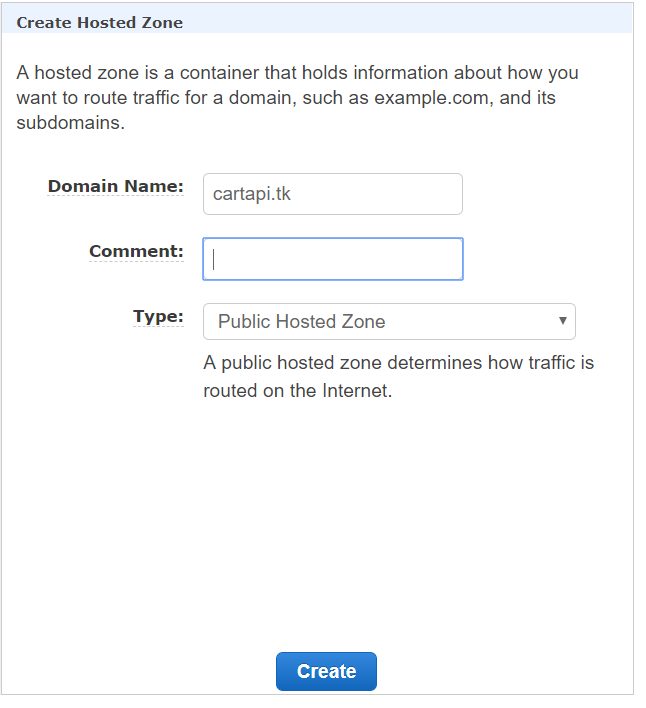
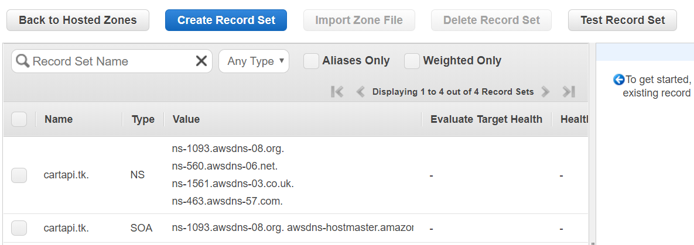
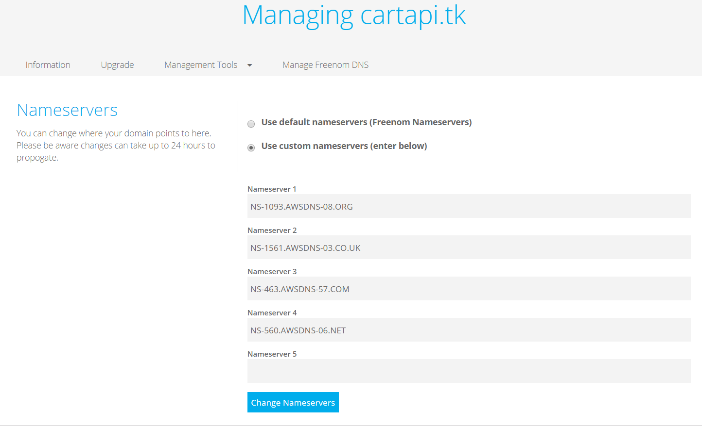
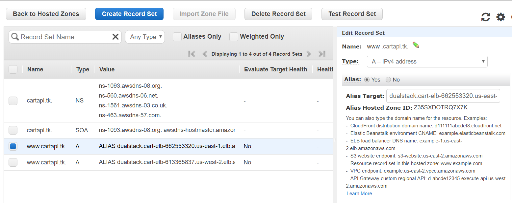
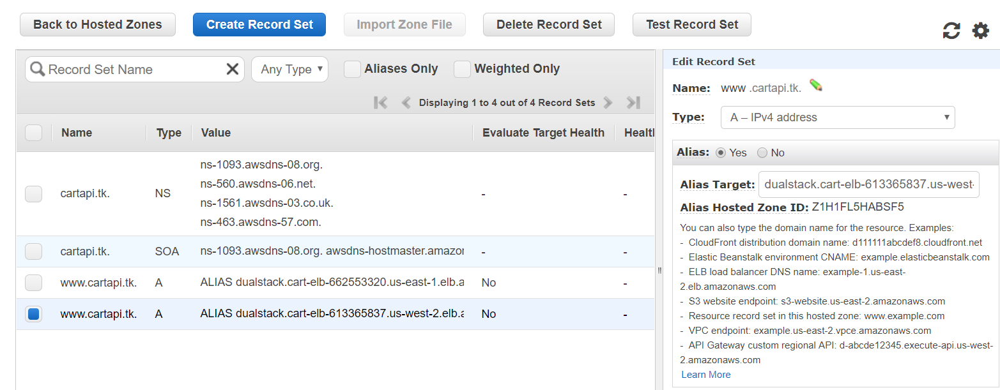
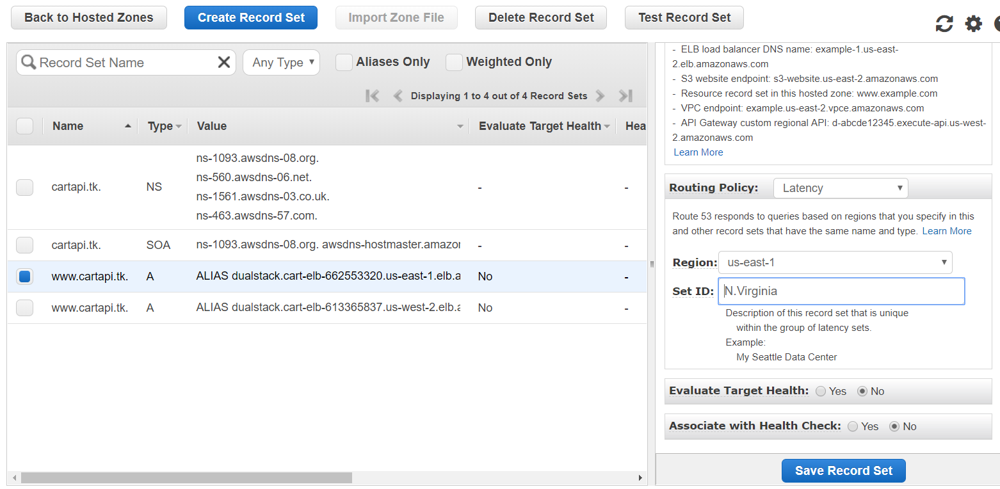
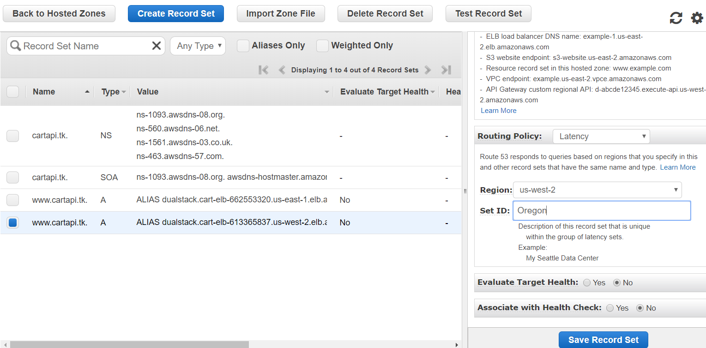
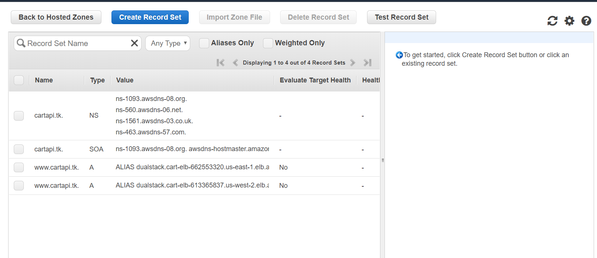
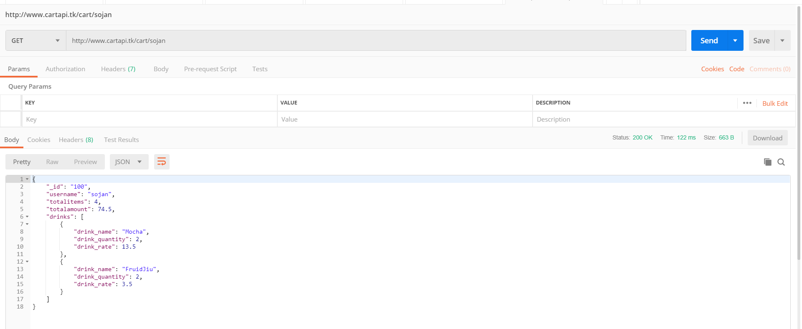

# AWS Route 53 CART API Walk-through

## Create Hosted Zone

- Open the Amazon Route 53 console using link − https://console.aws.amazon.com/route53/

- Click create hosted zone option on the top left corner of the navigation bar.

- Enter your domain name registered with any domain name registrar and a comment for the hosted zone. Click create zone after filling in the details



- Hosted zone for your domain will be created and you will be given four DNS endpoints called delegation set. These endpoints should to be updated in your domain names nameserver section. In my case, it is freenom.com. Go to your domain’s control panel and update the route53 DNS endpoints , deleting all the default values if any. The update will take a while to propagate.





## Route DNS Traffic for Your Domain to Your Load Balancers

 I have two public load balancers in two different aws regions. So I have to create seperate A records for different regions.

- Click create record set option , fill in the following details and create record set option.

```
name : append www
Type : A
Alias : 
YES - If you want to point the domain name to any load balancers, s3 or cloud front enpoints.
NO -  if you want to point the domain name to the servers ip.

In my case, i'm selecting no because am pointing the domian name directly to the servers ip address.

Value : address of your Load Address which is hosting your application
Routing Policy : latency 
There are four routing policies: simple , latency, weighted and failover.

Region : region where you have the instance.
Set ID : description for the record (eg : oregon data center)
```




## Setup Routing Policy

When you create a record, you choose a routing policy, which determines how Amazon Route 53 responds to queries:

-Simple routing policy – Use for a single resource that performs a given function for your domain, for example, a web server that serves content for the example.com website.

-Failover routing policy – Use when you want to configure active-passive failover.

-Geolocation routing policy – Use when you want to route traffic based on the location of your users.

-Geoproximity routing policy – Use when you want to route traffic based on the location of your resources and, optionally, shift traffic from resources in one location to resources in another.

-Latency routing policy – Use when you have resources in multiple AWS Regions and you want to route traffic to the region that provides the best latency.

-Multivalue answer routing policy – Use when you want Route 53 to respond to DNS queries with up to eight healthy records selected at random.

-Weighted routing policy – Use to route traffic to multiple resources in proportions that you specify.


Note: <b>We'll be using Latency Policy since we have two seperate regions and this policy will make sure the user gets the lowest latency by redirecting him to closest region.</b>







## Test Your URL

-Your Hosted Zone should have Four Record Sets as below:



-We'll test the URL using PostMan


